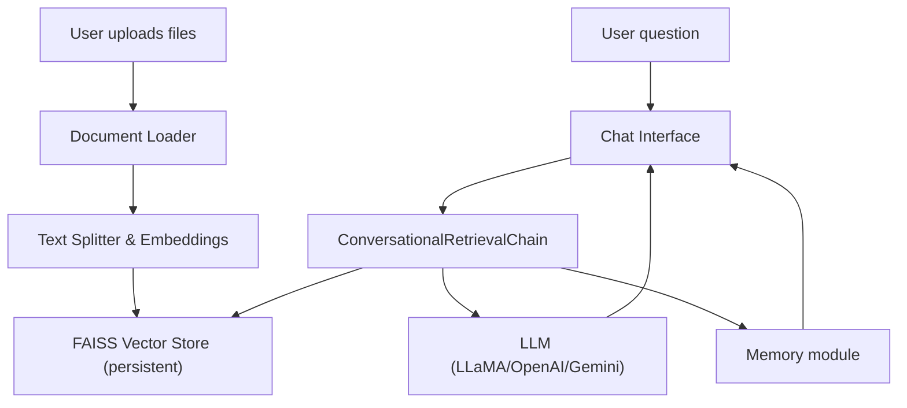

# AI Research Assistant with Contextual Memory and Multi-Document Reasoning

This capstone project provides a Streamlit-based research assistant allowing users to upload PDF, text, and CSV documents, index them with FAISS, and interact via a chat interface powered by LangChain. The assistant maintains conversation context, retrieves relevant information, and supplies structured answers with citations.

## Features

- 📄 Document upload (PDF, TXT, CSV)
- 🧠 FAISS-based vector store with persistent local directory
- 💬 Chat interface with conversation memory
- 🔗 Retrieval-based QA with citations
- 🔄 Multi-step reasoning chain (e.g., summarize→compare→answer)
- ⚙️ Support for multiple LLMs (LLaMA, OpenAI, Google Gemini) with LLaMA as default
- 🔍 Visualization tab (placeholder for future graphs or stats)

## Project Structure

```
Capstone/
├── .gitignore
├── README.md
├── requirements.txt
├── streamlit_app.py
├── settings.py
├── utils/
│   ├── doc_loader.py
│   ├── indexer.py
│   └── chatbot.py
└── data/  # persistent FAISS directory created at runtime
```

## Architecture Overview



The diagram illustrates the flow from file ingestion through to question answering. The FAISS store persists in `data/` and is reused across sessions.

## Setup

1. **Clone repository** (if applicable).
2. **Create a Python environment** (venv/conda/pipenv/poetry).
3. **Copy or edit the example environment file**:
   ```bash
   cp .env.example .env
   # then open .env and set keys/paths as needed
   ```
4. **Install dependencies**:
   ```bash
   pip install -r requirements.txt
   ```

> After starting the app you can pick the LLM backend from the sidebar. The
> selector defaults to **LLaMA** and operates completely offline as long as you
> supply a local model path (no API keys are required). Change to OpenAI or
> Gemini and you’ll be prompted for credentials. When you adjust the backend or
> paths/keys, click **"Apply changes / Rebuild chain"** to reload the underlying
> LLM chain with the new configuration.

> **Embedding provider**: by default the code uses OpenAIEmbeddings which requires
> an `OPENAI_API_KEY` environment variable. If you don’t have a key (or you’re
> using a local LLaMA backend), the system will automatically fall back to
> HuggingFace embeddings (`all-MiniLM-L6-v2`). You can also explicitly force
> OpenAI by setting `LLM_TYPE=openai` and providing the key.

> **Security note on FAISS indexes**: loading a saved FAISS index uses Python’s
> pickle format, which can execute code if the file has been modified. The
> code enables `allow_dangerous_deserialization=True` when loading from the
> local `data/` directory. Only ever load indexes you created yourself or
> otherwise trust; do not use this flag on files from untrusted sources.
5. **Run Streamlit app**:
   ```bash
   streamlit run streamlit_app.py
   ```

> **Important:** the app creates the retrieval chain on startup. If you
> haven’t indexed any documents yet the FAISS index file won’t exist and the
> retriever will be empty (queries will simply return no contextual results).
> Use the **Upload & Index Documents** sidebar panel before asking questions
> so that the vector store is populated.  If you don’t, the app will still start
> but queries will simply return empty responses until something is indexed
> (a lightweight dummy retriever is used in that case).

## LLM Options

The code is designed to be flexible with different LLM backends. By default it tries to use a local LLaMA model if `LLAMA_MODEL_PATH` is set, otherwise it falls back to OpenAI's `gpt-3.5-turbo`.

In addition to those options the app now supports **Ollama** (a lightweight HTTP server for local models such as `llama2`, `llama3`, etc.). You can point at a running Ollama instance and choose the desired model name.

### Configuring the backend

Set environment variables or modify `settings.py` directly. Common environment examples:

```bash
# use local LLaMA (replace with your model path)
export LLM_TYPE=llama
export LLAMA_MODEL_PATH="/path/to/llama/model.bin"

# or use a local Ollama server (e.g. running llama3)
# the default Ollama HTTP endpoint is http://localhost:11434 but you can change it
export LLM_TYPE=ollama
export OLLAMA_BASE_URL="http://localhost:11434"
export OLLAMA_MODEL="llama3"

# or use OpenAI instead (requires API key)
export LLM_TYPE=openai
export OPENAI_API_KEY="sk-..."
export OPENAI_MODEL="gpt-4o-mini"

# or attempt Google Gemini (still experimental)
export LLM_TYPE=gemini
export GEMINI_API_KEY="..."
```

> **Gemini note:** the current code only includes a placeholder branch; you'll need to implement the Gemini API wrapper yourself or rely on LangChain's Gemini integration once it's stable. Replace the `get_llm` function in `utils/chatbot.py` with a proper Gemini model initializer.

### Notes

- **LLaMA**
  1. **Install supporting packages.** The repository already depends on `langchain` which contains the `Llama` wrapper, but you will also need the transformer libraries if you intend to run the model locally:
     ```bash
     pip install transformers sentencepiece
     ```
     These are not strictly required if you plan only to use a remote LLaMA-serving service; they are needed when loading weights directly.
  2. **Obtain model weights.**
     - LLaMA weights are not included in this project. Download them yourself from Meta or any authorized distributor. For open‑source variants, see the HuggingFace hub (e.g. `meta-llama`).
     - Place the resulting binary (e.g. `ggml-model-q4_0.bin` or `pytorch_model.bin`) in a directory such as `~/models/llama/`.
  3. **Configure the path.**
     - **Environment:** add to your `.env` or export before running:
       ```bash
       export LLM_TYPE=llama
       export LLAMA_MODEL_PATH="/Users/mohan/models/llama/ggml-model-q4_0.bin"
       ```
     - **Streamlit UI:** start the app, open the **⚙️ Configuration** panel, select **llama**, and paste the full path in the **LLaMA model path** field. Click **Apply changes / Rebuild chain**.
  4. **Verify offline operation.**
     - After configuration, ask a simple query. You should see your local model being loaded (the console may print a load message). The app delivers answers without requiring any API key.
     - If the path is incorrect or the model fails to load, the code falls back to a tiny HuggingFace model (`gpt2`) so that the assistant still functions offline; only as a last resort will it call OpenAI.
  5. **Troubleshooting & tips.**
     - Ensure the model file is readable and not placed in a directory protected by permissions.
     - Use a smaller LLaMA variant (7B, 13B, etc.) if you encounter memory issues.
     - You can switch back to `LLM_TYPE=openai` temporarily to confirm the fallback logic.

- **Ollama**
  1. **Install and run Ollama.** Visit https://ollama.ai/ and follow the instructions for your OS. Once installed you can launch a local server: `ollama serve` (default port 11434) and then `ollama pull llama3` (or other model) to download the weights.
  2. **Configure environment or UI.**
     ```bash
     export LLM_TYPE=ollama
     export OLLAMA_BASE_URL="http://localhost:11434"  # change if using a custom port
     export OLLAMA_MODEL="llama3"                    # specify the model name you pulled
     ```
     In the Streamlit **⚙️ Configuration** panel choose **ollama**, then paste the base URL and model name. Click **Apply changes / Rebuild chain**.
  3. **Test connectivity.** After starting the Ollama server and setting the variables, ask a simple question like "What is 2+2?". If the model responds, the integration is working. Errors such as connection refused usually mean the server isn't running or the base URL is wrong.
  4. **Troubleshooting.**
     - Make sure the Ollama daemon is running (`ollama serve`) and the model you requested is downloaded (`ollama list`).
     - If you change models, update `OLLAMA_MODEL` and rebuild the chain.
     - Logs from the Ollama process (running in your terminal) will show requests and any errors.

- **Google Gemini**
  - This repository contains only a stub. To enable Gemini you must install the appropriate LangChain integration (e.g. `pip install google-ai-gemini` or similar when available) and update `get_llm` accordingly. Consult Google's documentation for API details. Without this, the assistant will default to the fallback OpenAI call.

- OpenAI models incur usage costs. Refer to OpenAI pricing.

You can also switch memory type by:

```bash
export CONVERSATION_MEMORY=summary  # or buffer
```

Feel free to extend `utils/chatbot.py` with new LLM classes if you add more providers.

---

## Code Walkthrough

1. **`utils/doc_loader.py`** – contains `load_documents` which accepts paths and returns LangChain `Document` objects. Supports PDF, TXT, and CSV.
2. **`utils/indexer.py`** – constructs a FAISS vector store. It splits documents into chunks, computes embeddings (default OpenAI), and persists the index under `data/`. A retriever helper simplifies search.
3. **`utils/chatbot.py`** – builds the QA chain. Memory can be a buffer or summary type. The chain demonstrates multi-step reasoning using `SequentialChain`: first summarizing retrieved context, then generating an answer with citations. The LLM backend is abstracted and can target LLaMA, OpenAI, or others.
4. **`streamlit_app.py`** – the Streamlit front‑end. Allows file upload and indexing in the sidebar. The main panel hosts a chat box and a visualization column showing index statistics. Session state retains history and the chain instance.
5. **`settings.py`** – central configuration file for paths, LLM choices, memory type, and other parameters. Environment variables override defaults.

Each module is lightly commented for clarity and extensibility.
